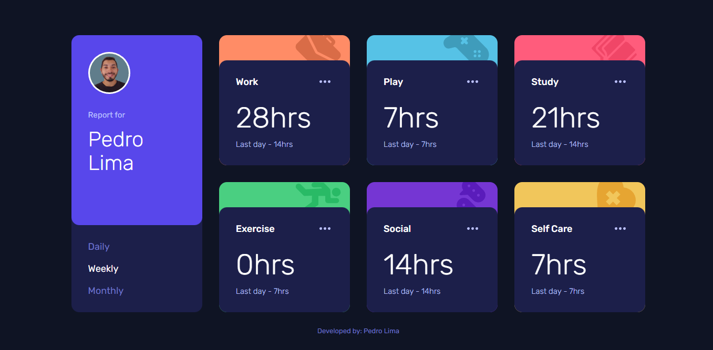

# TIME TRACKING DASHBOARD
Solução para criar um painel de controle de tempo.

## Índice

- [Visão geral](#visao-geral)
  - [O Desafio](#o-desafio)
  - [Screenshot](#screenshot)
- [Resultado](#resultado)
- [Minha caminhada](#minha-caminhada)
  - [Propriedades](#propriedades)
  - [O que aprendi](#o-que-aprendi)
  - [Recursos](#recursos)
- [Autor](#autor)

## Visão Geral

### O Desafio

Os usuários devem ser capazes de:

- Visualizar o layout ideal para o site, dependendo do tamanho da tela do dispositivo
- Visualizar os estados de foco para todos os elementos interativos na página
- Alternar entre a exibição de estatísticas diárias, semanais e mensais

### Screenshots

<html>
  <h4>Layout mobile</h4>
  
  <h4>Layout desktop </h4>
  
  <!-- 
  <h4>Layout mobile</h4>
  

  -->
</html>

## Resultado: [Veja como ficou!](https://painel-temporal.vercel.app/)

## Minha caminhada

1º dia
- [x] Planejamento
- [x] Preparativos

2º dia
- [x] Mobile layout

3º dia
- [x] Desktop layout

4º dia
- [ ] Features

5º dia
- [ ] Features

6º dia
- [ ] Features

7º dia
- [ ] Refatoração

### Propriedades

- Mobile-first
- Semântica HTML
- SASS
- TypeScript

### Meu aprendizado
...

Trechos de destaque:

TypeScript
```ts
...

...
```

SCSS
```scss
...

...
```

### Recursos

- [SASS - Documentation](https://sass-lang.com/documentation/) - Nesse site você saberá tudo sobre o mundo SASS.

- [O desafio da Frontend Mentor](https://www.frontendmentor.io/challenges/easybank-landing-page-WaUhkoDN) - Neste link você encontrará o desafio solucionado aqui.

## Autor

- LinkedIn - [Pedro A. Lima](https://www.frontendmentor.io/challenges/time-tracking-dashboard-UIQ7167Jw)
